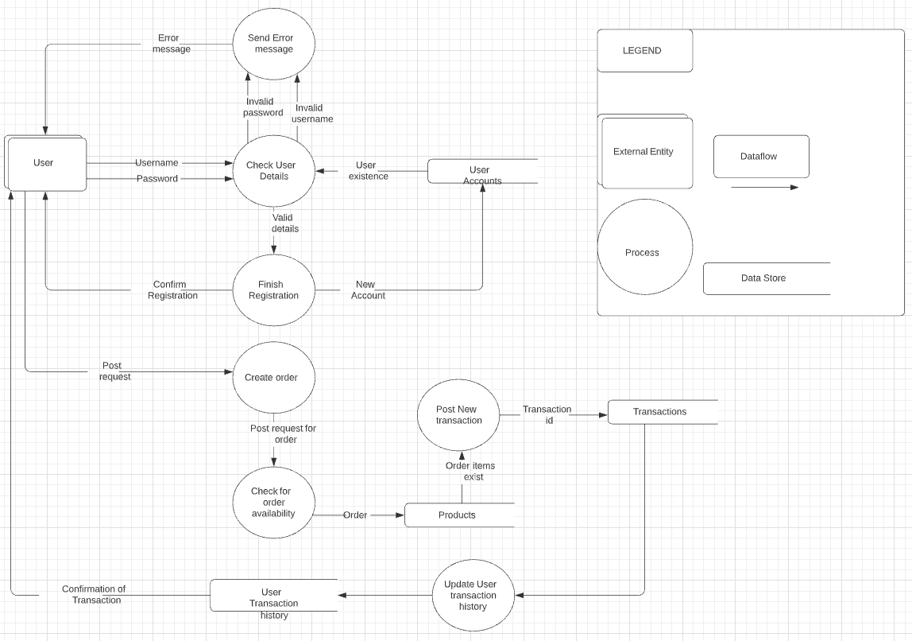
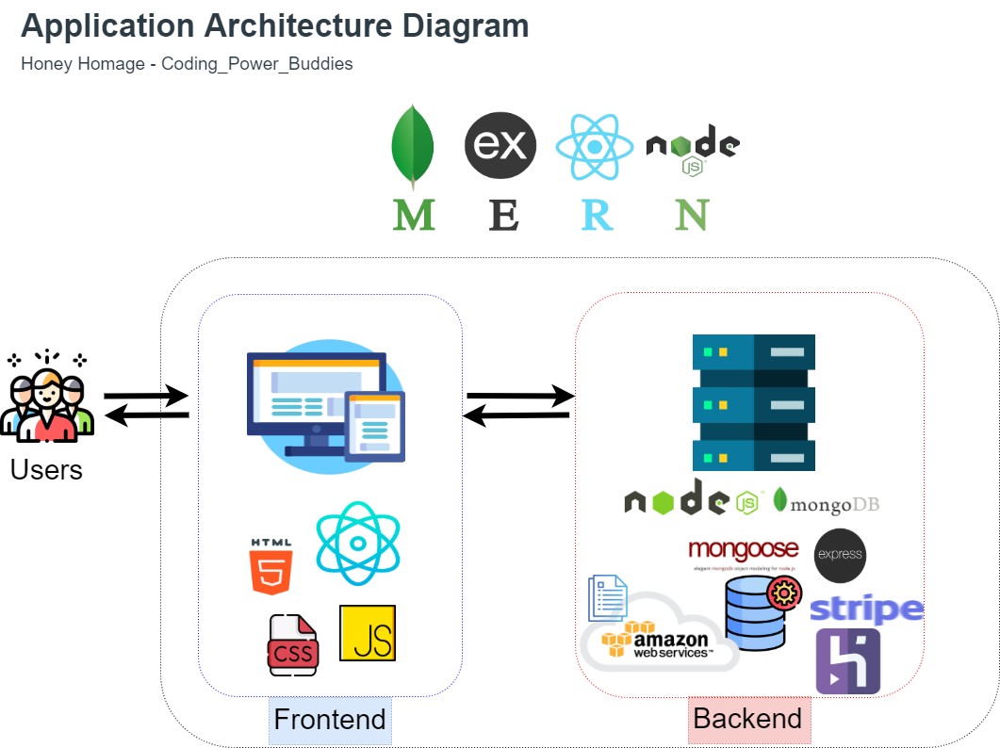
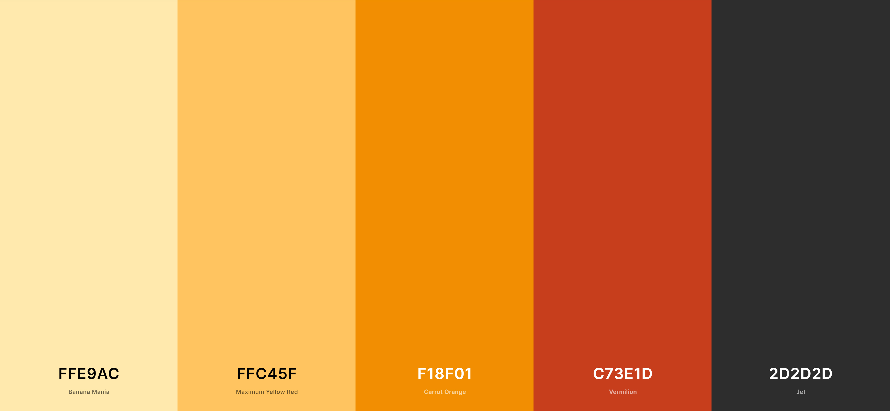
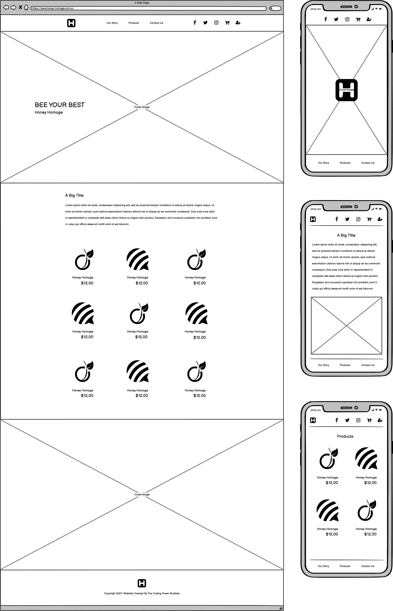
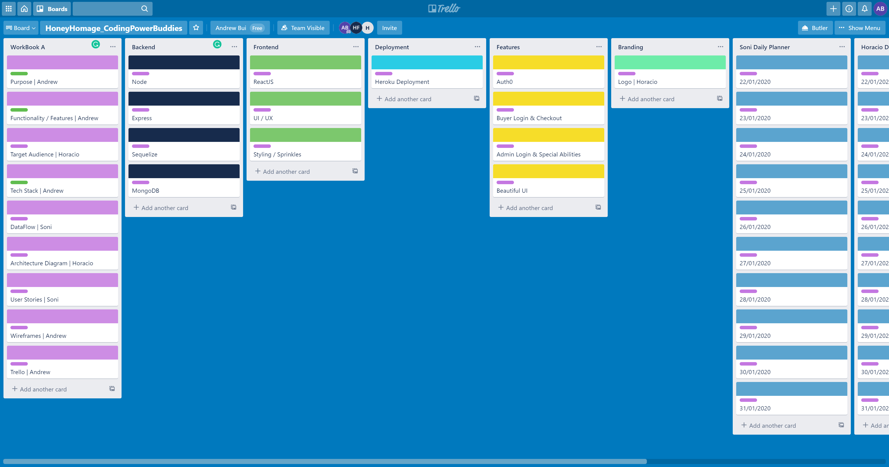
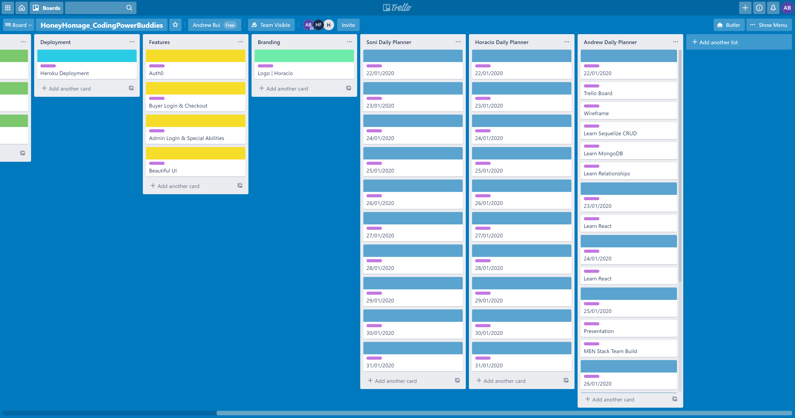
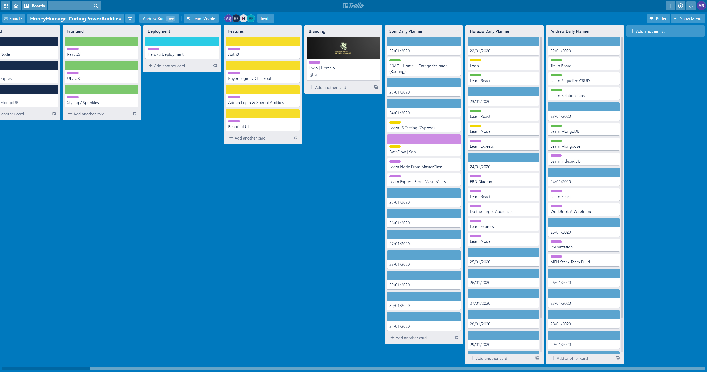

# Honey Homage

## Collaborators

Vilisoni | [GitHub](https://github.com/Soni-247) | [Portfolio]() 
Horacio Moran | [GitHub](https://github.com/HORACINIS) | [Portfolio](https://www.horacinis.com/) 
Andrew Bui | [GitHub](https://github.com/aBuiDev) | [Portfolio](https://abuidev.netlify.app/) 

#

 
 
 

## Deployment

[Github](https://github.com/HORACINIS/honey_homage)  
[Heroku Deployment](https://peaceful-reef-34834.herokuapp.com/)

#

 
 
 

## Purpose

In late 2019 and early 2020, Australia was ravaged by a horrifically devastating bushfire season that perished an estimated half-billion living creatures and caused toxic smoke clouds to cover populated cities. The heaviest hits were rural communities and farms, including one organic honey producer that lost over 500 beehives in one tragic day.

Honey Homage, located in eastern NSW had lost almost everything, but through pure grit, patience, and sheer determination following the fierce bushfires; has now cultivated new hives and is now in a position to start selling their organic honey products again.

Being an organic honey producer for almost 60 years, they relied on reputation, word of mouth and repeat wholesale customers to move their products. They don't have an online presence or modern website and because of the bushfires and having to stay out of the market to re-grow; they have become forgotten within the market.

As a passionate team of three with a broad skill set that includes digital marketing, brand identity, design, and full-stack web development; our purpose is to bring Honey Homage online onto a digital market with an optimised online store.

#

 
 
 

## Functionality / Features

**Website:**

- Stripe Payment System
- Buyer Login System
- Admin Login System
- Add to Cart & Checkout System
- Beautiful and Engaging Frontend
- User Focused UX and UI

**Digital Marketing:**

- Link to Social Media Channels
- Google Adwards
- Search Engine Optimisation

**Design:**

- Custom Logo
- Custom Marketing Materials
- Custom Graphics

#

 
 
 

## Target Audience

- Local community
- Bulk-buying customers
- Aim to reach all of Australia

#

 
 
 

## Tech Stack

**Database**: MongoDB, Mongoose  
**REPL & Server**: Node.js, Express.js  
**Frontend**: HTML, CSS, and React.js  

#

 
 
 

## Dataflow Diagram

Our datalow diagram outlines the process of reigistering a user as well as sending request to create a transaction within the server.

 
 
 

## Application Architecture Diagram

#

 
 
 

## User Stories

As an Admin,
I would like secure my website from malicious attacks.
So I can restrict access to change information of the shop index.

 

Given that the Admin has entered the correct account details.
When the account holding the admin status is signed in,
Only then, products can be added to be sold, deleted, and/or edited.

 

As an Admin,
I want to display a description of a product.
So I can advertise the selling item with the corresponding details.

 

Given that the Admin is signed in,
When the link option to add an item is clicked,
A form to advertise a product is rendered.

 

As an Admin,
I would like to attach a photo of the selling product.
So that I can advertise the exact item being bought.

 

Given that the Admin has filled out the form to add a product.
When the upload image button is clicked,
The product is advertised with the photo set.

 

As a User,
I want to an easy access to my account settings,
So that I can make necessary amends if needed in the future.

 

Given that the User has clicked the link to their profile.
When changes are made within the account form is saved,
Only then information changed by the user is updated.

 

As a User,
I want a list of products being sold,
So that I can choose to buy what is available.

 

Given that the user is on the root page,
When the index is selected,
Then all available products are displayed.

 

As a User,
I want a record of the products being selected.
So I can specify the amount of a product desired before purchasing.

 

Given that the User is registered,
When the link is clicked to add to cart,
Then the desired amount of an item is added to User’s order list.

 

**Sue**
 

 

Sue, 35, is a chef of a popular restaurant in the Inner-West of Sydney.
With a rising demand of her Sticky Asian Wings’, Sue needs to buy honey in large quantities every week depending on the fluctuating trend of her sales.

**Joseph**
 

 

Joseph, 33, owns a small takeaway cafe nearby a busy train station. Enthusiastic with trying new things, he begins selling a new coffee called the ‘bees neez’. To survive the week, Joseph uses 2 jars of honey and restocks with the same amount.

**Mason**
 

 

Mason, 71, is a kind hearted, long time resident of the land down under. As a retiree, Mason loves to catch up with reading the newspapers in the morning. Invested in the story of the 2020 bushfires, he would like to contribute in helping those recovering any way he can.

 
 
 

## Wireframes

- Color Palette

 

- Layout

#

 
 
 

## Trello

[Link to CodingPowerBuddies | Honey Homage Trello Board](https://trello.com/b/SNIFSg7r/honeyhomagecodingpowerbuddies)

 

- Project Part A and Part B Plan

 

- Project Team Member Daily Planner

 

- Team Update: Initialising Progress

#

 
 
 

## Testing 

### Development Desktop

| Type | Task | Outcome | Comments |
|------|------|---------|----------|
| Authenticate | Successful signup | Pass | No prompt to confrim password. Prompt to confirm signup.|
| Authenticate | Successful signin | Pass | |
| Authenticate | Reject of invalid email or password | Pass | Alerts user of invalid input |
| Authenticate | Successful log out | Pass |  |
| User Profile | Displays user details | Pass | Minimum style.|
| Products | Successfully renders all products from database | Pass | | 
| Cart | Reject request to add item in cart with no quantity defined. | Pass | Alerts user to specify quatity before adding. |
| Cart | Reject request to add item in cart with no user signed in. | Pass | Alerts user it is required to sign in before adding to cart. | 
| Cart | Successfully adds item into cart with declared quantity. | Pass | Does not notify user that item was added. | 
| Cart | Cart icon displays number of products added. | Pass | |
| Cart | Returns price total for all products added. | Pass | |
| Cart | Cart items stored in database | Fail | Stored locally. |
| Cart | Cart icon returns number of items as null after purchase. | Fail | |
| Cart | Cart is empty after purchase. | Fail |
| Checkout | Successfully collects shipping address from user | Pass |  |
| Checkout | Successfully collects contact phone number from user. | Pass | | 
| Checkout | Retrieves data from order form to finalise transaction. | Pass | | 
| Admin | Only renders Admin portal button for the account with Admin status. | Pass |  |
| Admin | Successfully shows the records of orders passed with their owning user details. | Pass | | 

